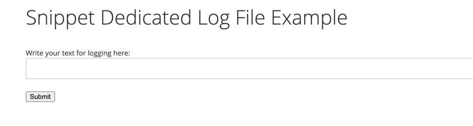
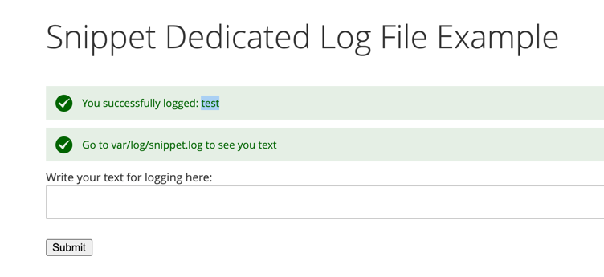

***Snippet_DedicatedLogFile***

**Description** 

Example of how to start using a dedicated log file

**How to install**
- composer require magento2-dedicated-log-file
- php bin/magento module:enable Snippet_DedicatedLogFile
- php bin/magento setup:upgrade
- php bin/magento clean:cache

**Example**

Go to: `http://{host.name}/snippet/log/`

and you will see the following form:

Write you text and submit:

Observe the content of the file: `var/log/snippet.log`
